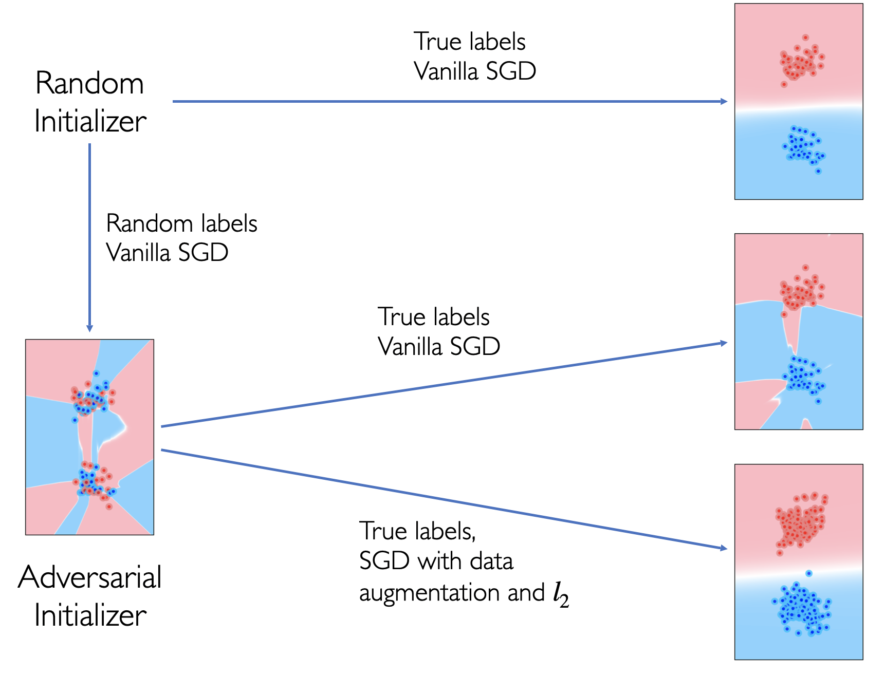

# Bad Global Minima Exist and SGD Can Reach Them

#### Authors: [Shengchao Liu](https://chao1224.github.io/), [Dimitris Papailiopoulos](http://papail.io/), [Dimitris Achlioptas](http://cgi.di.uoa.gr/~optas/)

In this project, we answer two main questions:

1. Bad global minimum do exist (here we refer the bad minimum as the model that can perfectly fit the training data, yet it generatizes poorly).
2. We can construct such bad global minimum using unlabeled training data **only**, without the knowledge of the loss-landscape.

A toy example is given as follows, for the complete results, feel free to check out the [full paper](https://arxiv.org/abs/1906.02613).



## Environments

```
wget -q –retry-connrefused –waitretry=10 https://repo.continuum.io/archive/Anaconda2-4.3.1-Linux-x86_64.sh
chmod 777 *
./Anaconda2-4.3.1-Linux-x86_64.sh -b -p ./anaconda > /dev/null
chmod 777 *

conda install --yes pyyaml > /dev/null
conda install --yes HDF5 > /dev/null
conda install --yes h5py > /dev/null
conda install --yes -c rdonnelly libgpuarray > /dev/null
conda install --yes -c rdonnelly pygpu > /dev/null
conda install --yes pytorch=0.3.1 torchvision -c soumith > /dev/null
chmod 777 -R ./anaconda
```

## Cite Us

```
@article{liu2020bad,
  title={Bad global minima exist and sgd can reach them},
  author={Liu, Shengchao and Papailiopoulos, Dimitris and Achlioptas, Dimitris},
  journal={Advances in Neural Information Processing Systems},
  volume={33},
  year={2020}
}
```